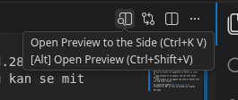

Hej Kristoffer, som aftalt i timen d.28/05 sender jeg dig en liste over mine opgaver så du kan se mit arbejde.
Du tilføjede at jeg sendte en one liner med forklaring om whys - godt eller dårligt osv - Så det tiløjer jeg også til alle de manglende opgaver opgaverne.

I denne mappe 'system_sec' kan du se ALLE opgaverne, også dem som allerede er blevet checked. 
Du kan se status for opagverne på selve fil navne.
så 
- exXX_checked er en opagver som har fået fulde points.
- exXX_tocheck er en opgave som ikke er blevet vist til dig eller Victor.

De manglende opgaver er **13_5 til 17.**
Formatter er MD, så hvis du klikker på vinduet open preview, kan du se dem i pænere format.

Hvis du ser dem direkte på github behøver du ikke gør noget - det ser pænt ud i formattet i browseren.

Mvh Emma