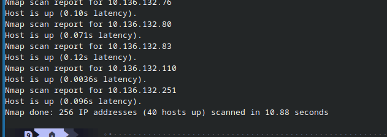
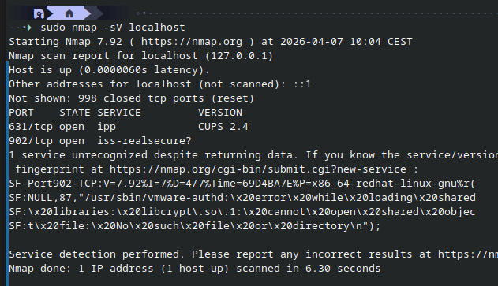
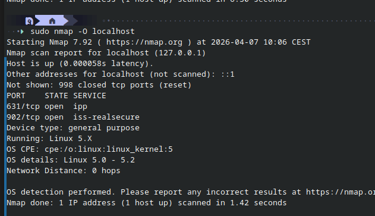

3.a — Install / Update Nmap
```bash
# Check if already installed
nmap --version

# Easy install
sudo apt install nmap
sudo dnf install nmap # for me

# Install from source (gives you the absolute latest version)
bzip2 -cd nmap-7.95.tar.bz2 | tar xvf -
cd nmap-7.95
./configure
make
sudo make install
```

Why install from source?
- You get the latest version with the newest features and bug fixes
- `apt` often has an older version in its repositories

Checking integrity of the download:
- Download the SHA256 checksum from nmap.org alongside the file
- Then verify:
```bash
sha256sum nmap-7.95.tar.bz2
```
- Compare the output to the checksum on the website — if they match, the file is untampered

---

3.b — Scan Hosts
```bash
# Find your local IP range first
ip a

# Scan your home network
nmap -sn 10.136.132.0/24

# Scan with OS detection
sudo nmap -O nmap -sn 10.136.132.0/24 --- unreliable without port scan
```



10.136.132.1: gateway/router
10.136.132.2 (ekko-loq): that's me 
10.136.132.3–251: other devices on the network

!!! school network scan-- but no port : that is illegal cause not my own


- `-sn`: ping scan, just finds live hosts without scanning ports
- `-O` : tries to detect the OS of each host
- Make sure all devices are turned on before scanning so nothing is missed
- Common surprises: smart TVs, printers, old phones etc if range is wrong
- Nmap often identifies hardware vendor from the MAC address


3.c — Scan Services
```bash
# Scan all services on own machine
sudo nmap -sV localhost

# Scan a specific host on network
sudo nmap -sV 192.168.1.x
```

- `-sV` — detects what service and version is running on each open port

**Results:**

- 631/tcp — CUPS 2.4 (printing service)
- 902/tcp — VMware Auth Daemon
- 5900/tcp — SPICE 2.2 (VM remote display)


**Analysis:**

- **631 — CUPS**: Common Unix Printing System. Manages printers on Linux.
  Can be disabled if you don't print.
- **902 — VMware Auth Daemon** — Used by VMware Workstation to authenticate
  remote connections to VMs. Expected on my machine since I run VMware.
  Currently throwing a missing library error (`libcrypt.so.1`) so it is
  not fully functional anyway.
- **5900 — SPICE** — Remote desktop protocol used to display VM screens.
  Normal since I run virtual machines.

**Should I remove any?**
- Nothing alarming — all three services match my setup.
- CUPS could be disabled if I wanted to reduce attack surface.
- 902 and 5900 are expected given my VM usage.

**When should you do this?**
- Always on machines w internet or work machines?
- As part of initial server setup (hardening)
- Any machine w sensitive data.




not 100 accurate, my kernel is newer