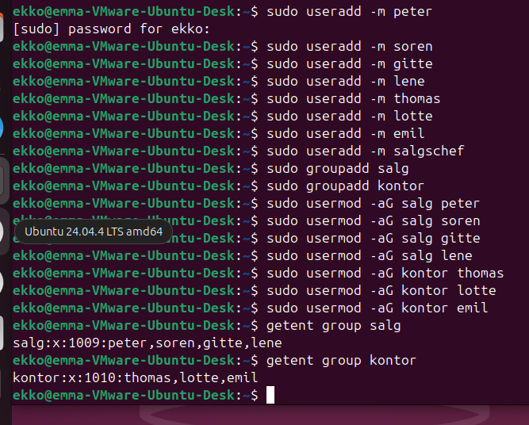

Exercise 5.1
• File permissions and ACL
• Make users: peter, soren, gitte, lene, thomas, lotte, emil
• Make group salg with peter, soren, gitte and lene
• Make group kontor with thomas, lotte and emil

• In the root directory, make a directory /okonomi
• Add a few txt files into that directory
• Make user salgschef the owner of that directory
• Give group salg read and write permission, and group kontor read
– And modify default to macth this
• Give lotte also write permission
– And modify defaults to match this
• Give all other users no permissions. (Also update defaults)

• Make your own experiments
• What is this an example of?
of an access control list, an extension of standard Linux perms for fine-grained control per user or group, more than basic owner/group/other model.
• What is it good for?
When you need different permissions for multiple groups or specific users on the same resource. For ex, here Lotte has other permissions than her group, its independant of her group.

