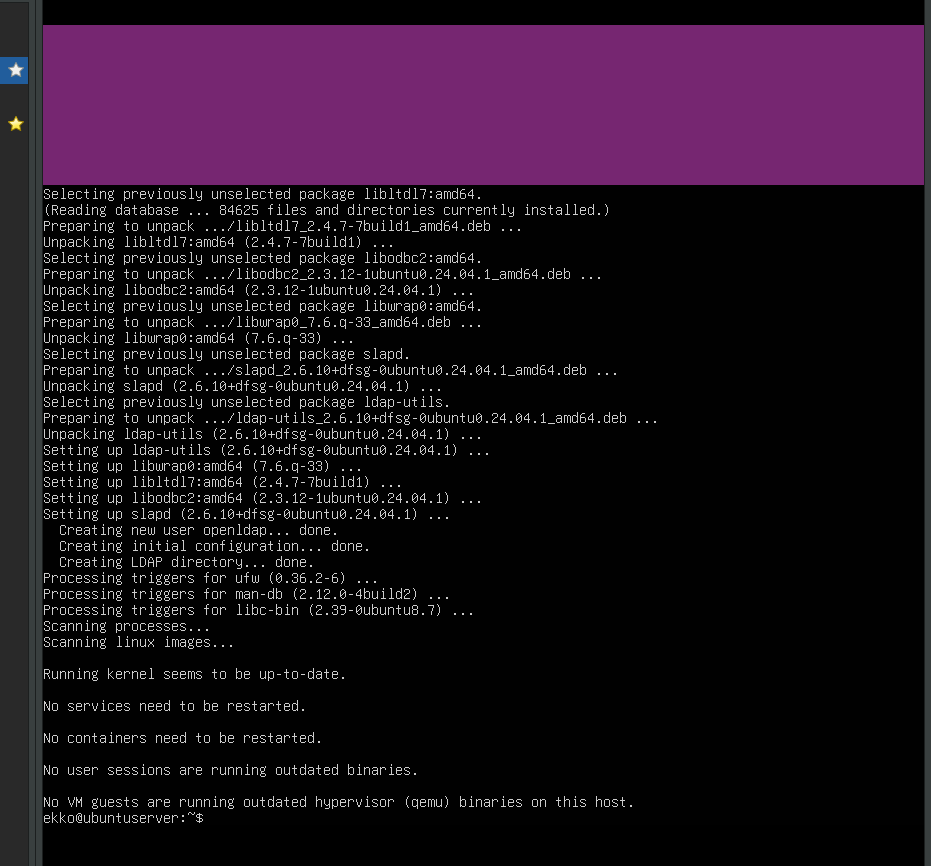
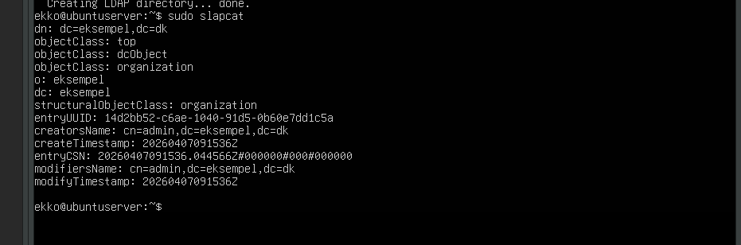
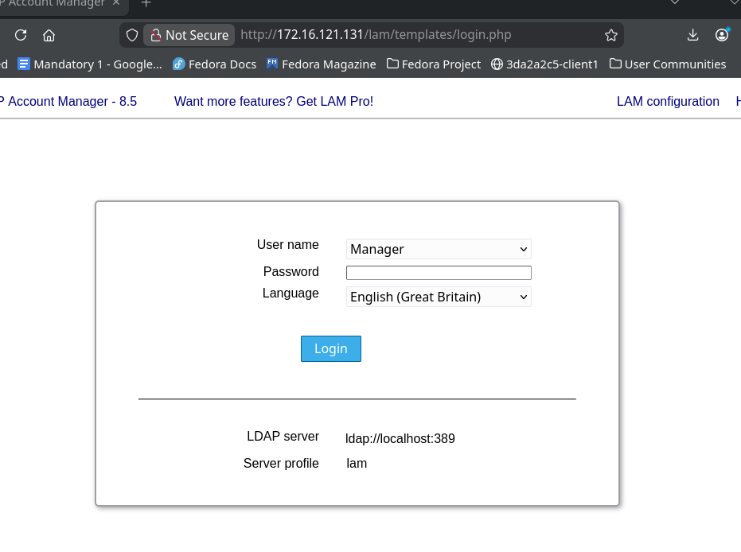
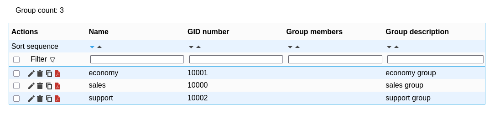
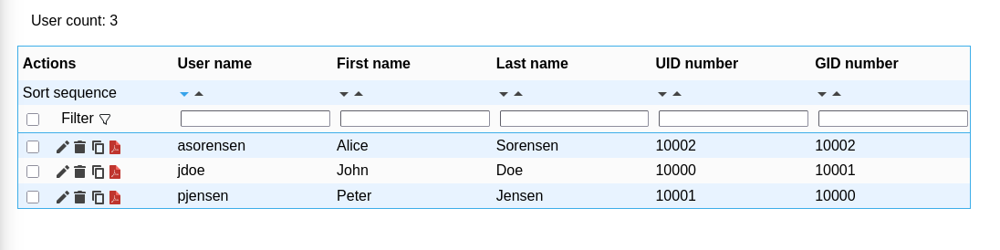
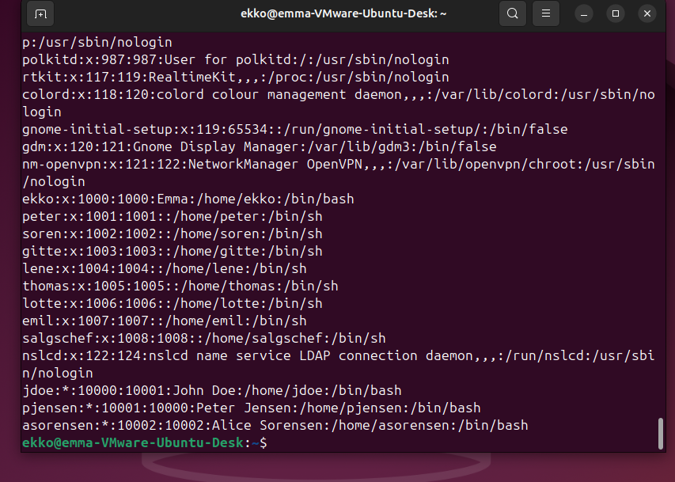

## Exercise 6.1 Overview

1. Install Ubuntu Server VM
2. Install + configure LDAP server (`slapd`)
3. Install LDAP Account Manager (web UI)
4. Add groups: `sales`, `economy`, `support`
5. Add users: `John Doe`, `Peter Jensen`, `Alice Sorensen` (use high UIDs!)
6. Install + configure LDAP client on Ubuntu Desktop VM
7. Test: log in to client using LDAP user credentials

> getent passwd

