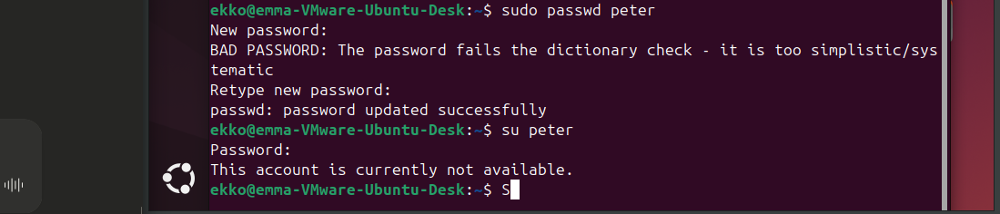
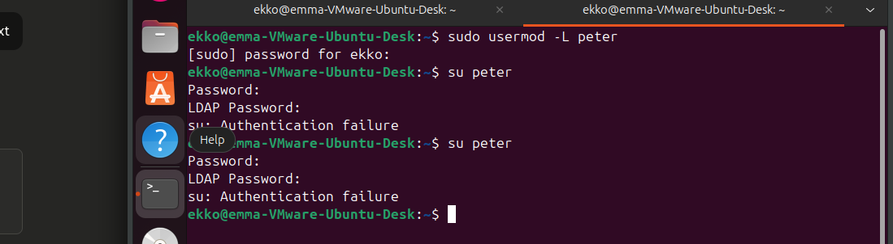
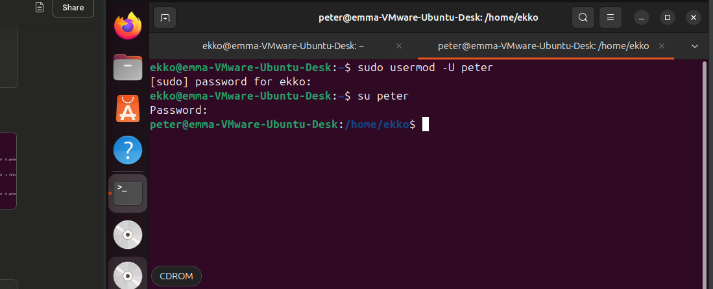
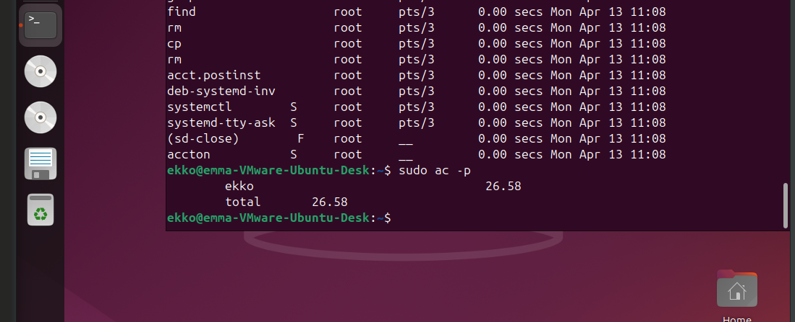
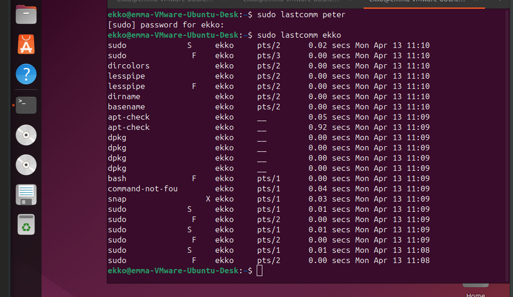
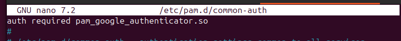
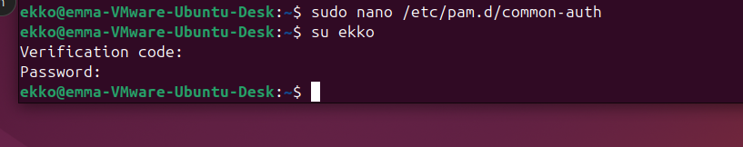

Exercise 7.1
• Limiting user login.
– Change a user’s login shell to nologin.
– Lock/unlock a user with the usermod command.
• Install the acct package.
• View login time of users.
• View a user’s performed commands.

Exercise 7.2
• If you have a Windows PC and Ubuntu 22
– Install and configure the pamusb package.
• Test a user login using only a USB token.
• Test a user login requiring both password and USB token.
– Warning: Don’t lock yourself out! (Use VMware backup snapshot)
• Or
– Research Ubuntu to add PAM for using a different physical
device than USB.
• Maybe a mobile app, like Google auth.
– https://linux.how2shout.com/how-to-use-google-two-factor-authentication-
with-ubuntu-22-04/
• Maybe some other method.
• Why do we like a second factor? (2FA)
beacuse a pwd can be stolen, hacked or leaked, or guessed etc - a second factor requires you hhave both the pwd and the 2fa method of auth at the same time. so even if someone has teh pwd, they cant use it whithout your auth app fx

– Is Facebook login a second factor?
• (why yes / why not)

no, not really. 
if facebook sends sms, then yes, but if you just use you fb acc to login somewhere you just delegate the login to the fb account login - and this one is still single sign on

