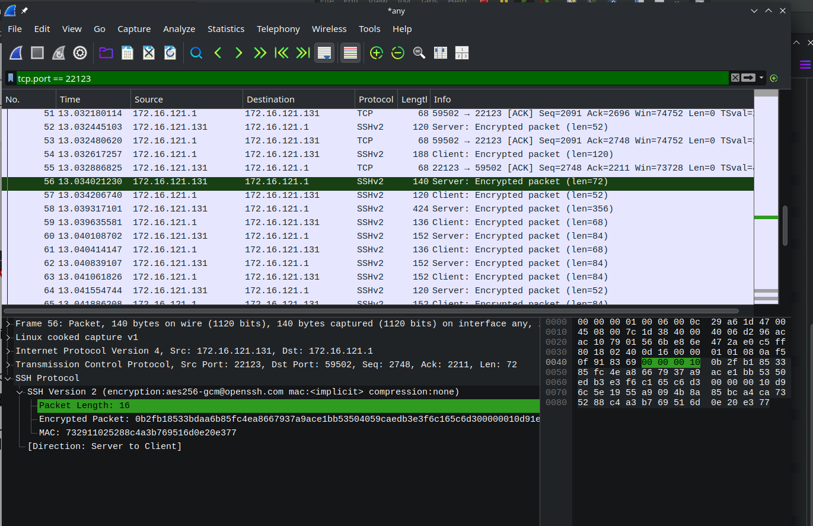
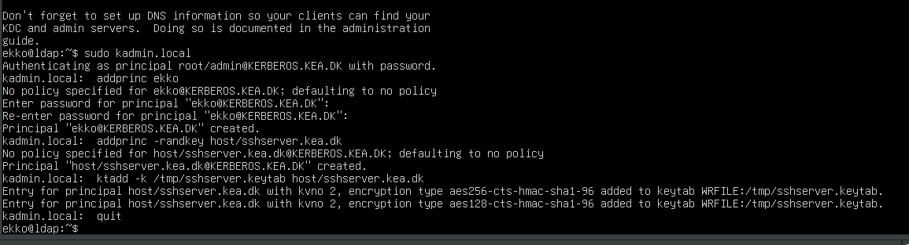
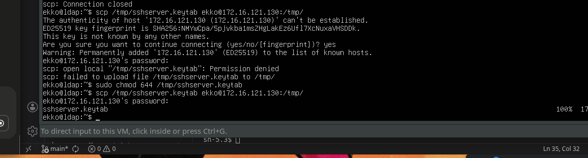
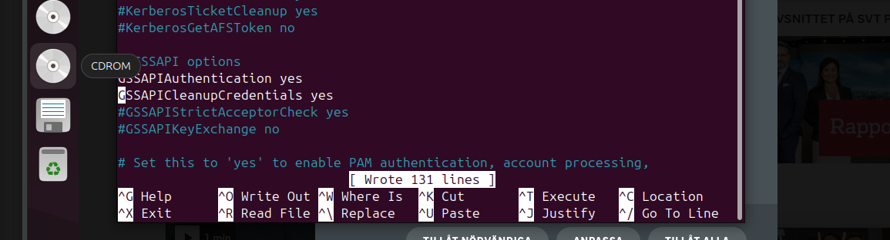
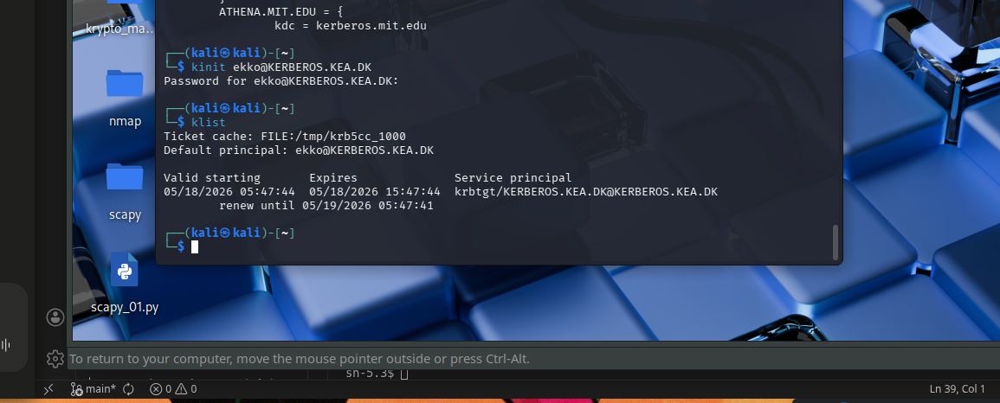
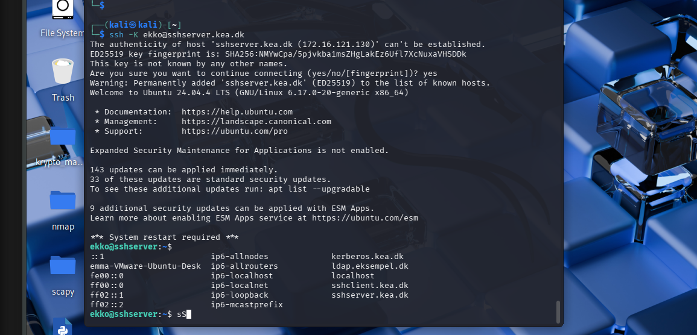

Exercise 9.1
• Test scp
– Transfer a file using scp.
– Catch packets in wireshark and show if packet
content is encrypted or not.
• Test sftp as you did with scp.
– Use packet capture and/or wireshark to see that
the transfered file is encrypted.

Exercise 9.2
• Research and prepare a Kerberos presentation.
– What is it?
– What is it good for?
• (What problems are solved / not solved.)
– How does it work?
• You should be able to explain to a beginner.
– Max 2 slides.

[SLIDESHOW](https://docs.google.com/presentation/d/1ueCuiSSLBnnBD9VPxCIiaCV6o2axEE4oM0RPKMQWZhc/edit?usp=sharing)

Exercise 9.3

Ubuntu server = kerberos KDC : 172.16.121.131
UUbuntu desktop = ssh server : 172.16.121.130
Kali = SSH client : 172.16.121.128

m server to desktop

