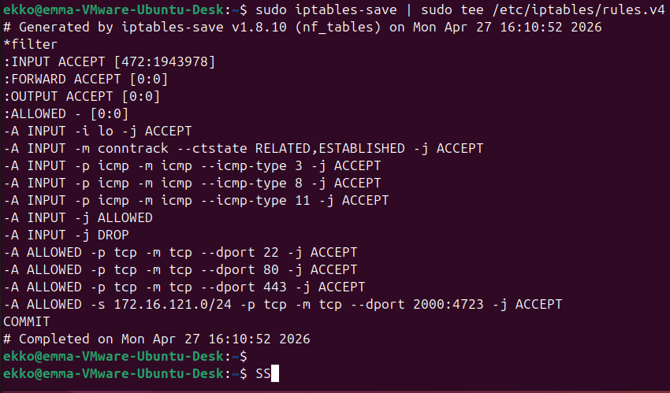

ex 11.2:

Gateway FW defends against external traffic, but not internal traffic on LAN. so if one mahcine is compromised in network - its an attack vector and can be used to attack all others on network.

Adds defende layer. Instead of just having one layer of defense we add layers to the defense. One more is better than just the one, if the one doesnt wokr, then the other might be the one to save teh day, 

They should complement each other, not replace each other. 