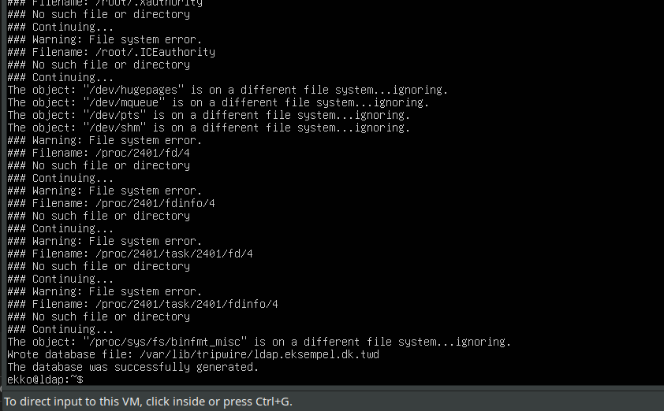
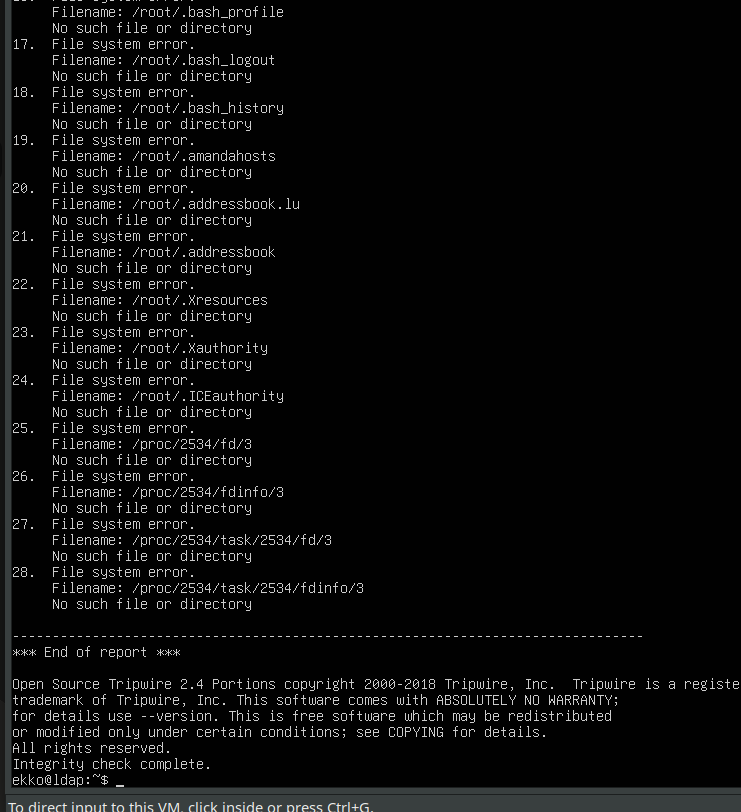
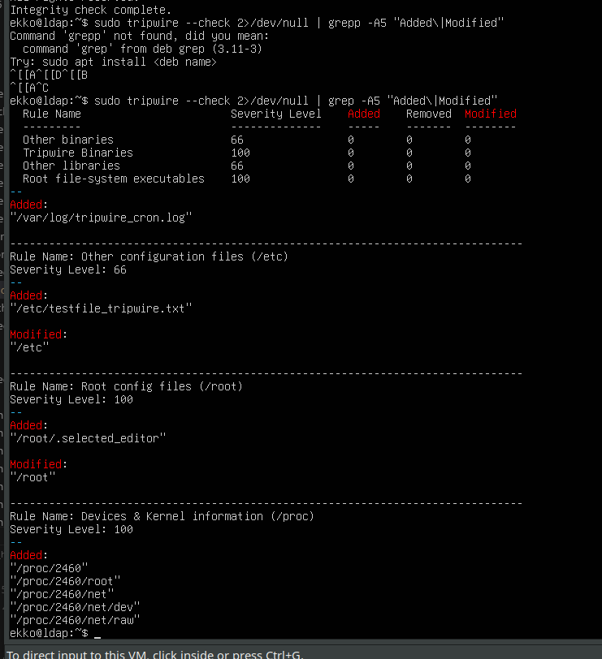
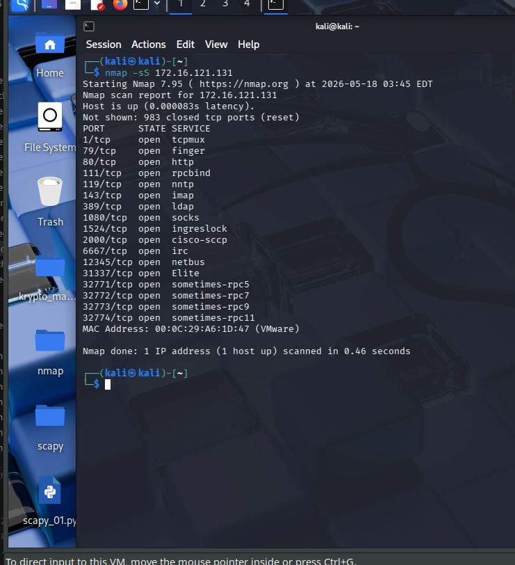
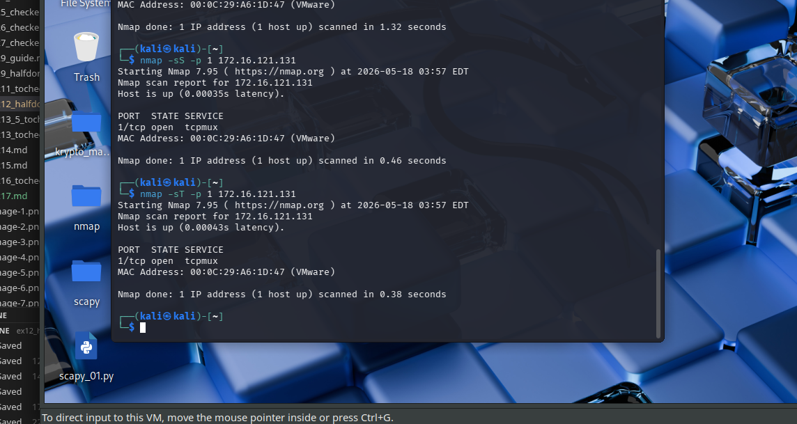
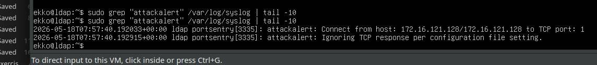
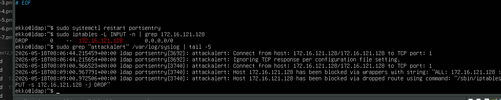
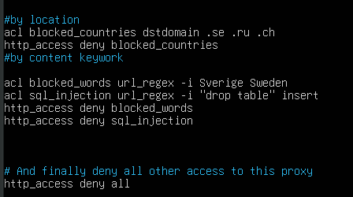
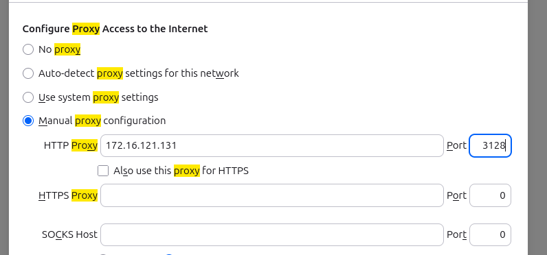
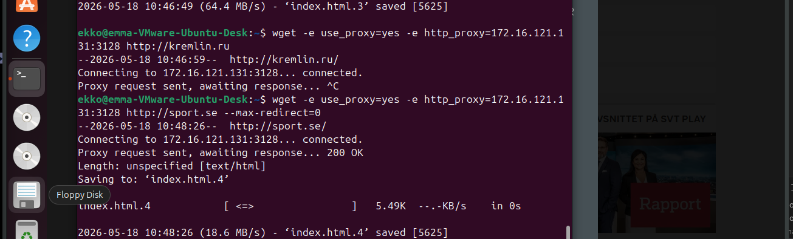

Opgaver 12:

12.a sXID

_____

12.b Tripwire (ligner meget sXID — detekterer ændringer i filer):
bashsudo apt install tripwire
sudo tripwire --init
# opret/ændr en fil i protected dir
sudo tripwire --check

12.c PortSentry (detekterer og reagerer på nmap-scans):
bashsudo apt install portsentry
# edit /etc/portsentry/portsentry.conf
# scan fra Kali med nmap, se hvad PortSentry opdager

12.d — SquidProxy (proxy-filter på indhold og domæner).

squid dstdomain ACL virker kun på HTTP
Når en side redirecter til HTTPS, går forbindelsen via CONNECT tunnel som Squid ikke kan inspicere