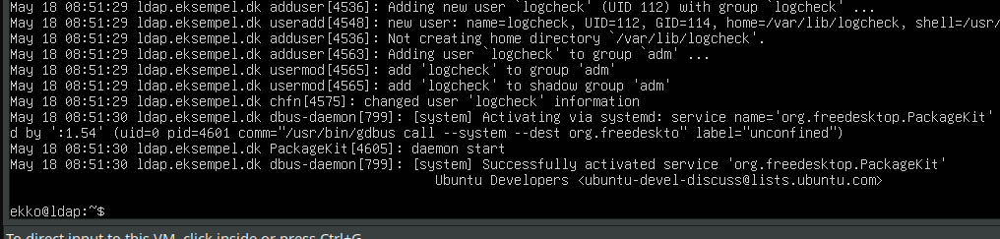
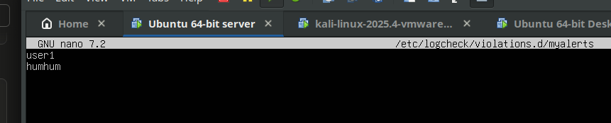
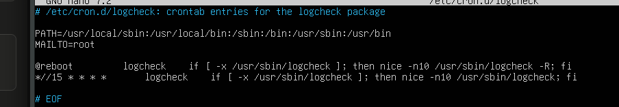

Exercise 14

Exercise 14.a — Logcheck

Exercise 14.b — MultiTail (optional)
bashsudo apt install multitail

# Basic: two logs
multitail /var/log/syslog /var/log/auth.log

# Three logs in 2 columns
multitail -s 2 /var/log/syslog /var/log/bootstrap.log /var/log/auth.log

# With colour
multitail -ci yellow /var/log/auth.log -ci blue -I /var/log/bootstrap.log

The -I option interleaves the second log into the first window instead of splitting

Exercise 14.c — Glances (optional)
bashsudo apt install glances
glances                              # run locally
glances -t 2                         # faster refresh

# Remote monitoring
# On server:
glances -s -B 172.16.121.131
# On client:
glances -c 172.16.121.131

Exercise 14.d — Whowatch (optional)
bashsudo apt install whowatch
whowatch
Then in a second terminal, SSH in as another user and watch them appear in Whowatch. Try the kill function from the menu.

Exercise 14.e — stat (optional)
bashstat /etc/passwd           # file
stat /var/log              # directory  
stat -f /                  # filesystem
Note the three timestamps: Access, Modify, Change — and what each means.

Exercise 14.f — lsof (optional)
bashsudo lsof | wc -l                    # total open files
sudo lsof -i                         # network connections
sudo lsof -i tcp                     # TCP only
sudo lsof -i -u ekko                 # by user

**WHY**

Log monitoring tools: uden kontinuerlig log-overvågning er man blind for angreb der allerede er i gang; disse værktøjer giver situationsbevidsthed i real-time. SÅ det er RIGTIG godt.