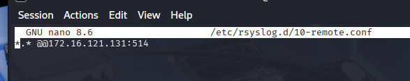
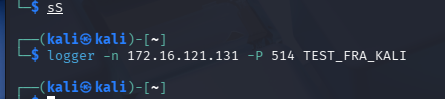
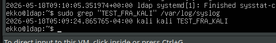
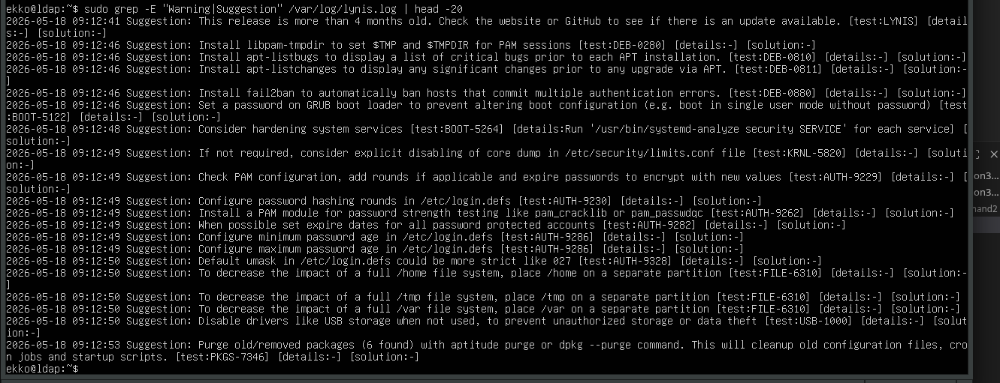

# System Security — Session 15 Exercises
## rsyslog (Remote Logging) + Lynis (Security Auditing)

- Ubuntu Desktop = sender
- Ubuntu Server `172.16.121.131` = receiver
- Metasploitable2 `172.16.121.136` = extra Lynis target

# Exercise 15.a — Remote Logging with rsyslog

# Exercise 15.b — Security Auditing with Lynis

Suggestions
Install fail2ban: Automatisk ban af brute-force forsøg
Set GRUB password: Forhindrer boot i single-user mode uden password
PAM password strength Kræv stærkere passwords
Configure password expiry: Passwords skal udløbe
Default umask 027: Mere restriktive fil-permissions som default
Disable USB storage: Forhindrer uautoriseret data-kopiering

## Exercise 15.c — Can Lynis Audit Application Configs?

**Question:** If you have CRM or billing software installed — can Lynis audit that too?

Lynis checks if SW is installed and notes it. Can flag outdated versions.

but mostly no: Lynis does not understand app specific configs.
It won't know if your CRM has weak API keys, no rate limiting, or misconfigured roles.

Instead we need app spec audit tools, manual security review, or pen testing of app layer.

--> Lynis covers the **OS layer**. The app layer is a separate security domain requiring separate tools.

**THE why osv**

rsyslog + Lynis: remote logging sikrer at beviser ikke kan slettes lokalt, og Lynis automatiserer den OS-hardening audit det ville tage timer at lave manuelt, så meget sikkrere måde at have logs på.