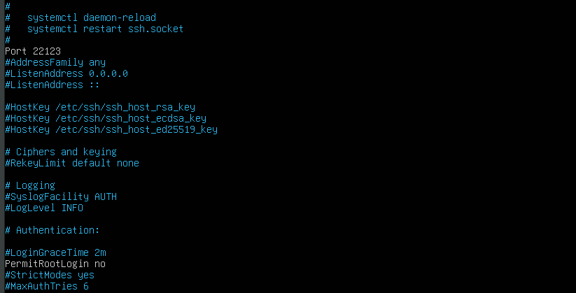
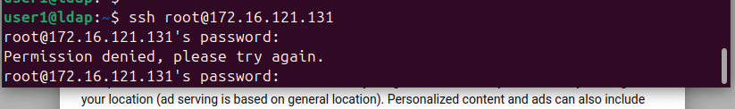
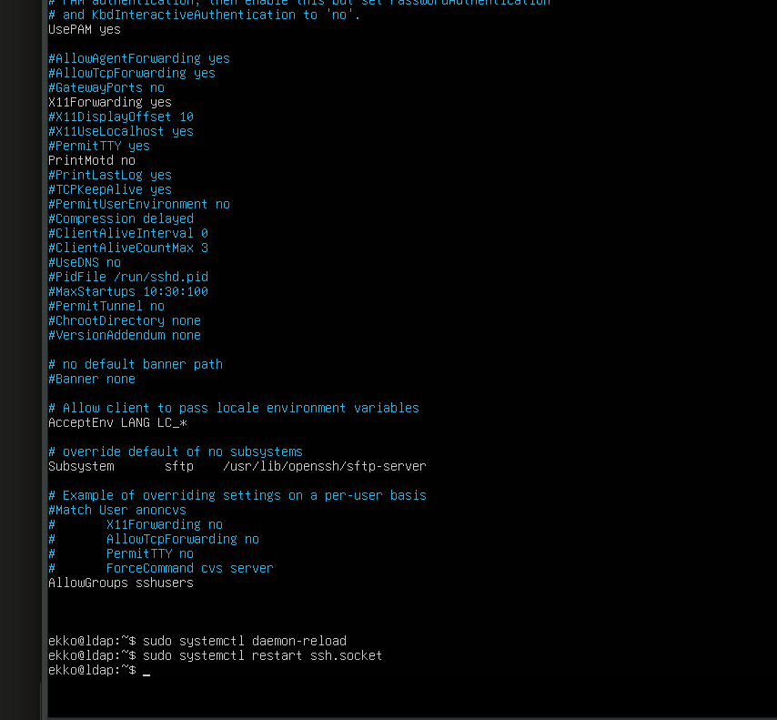
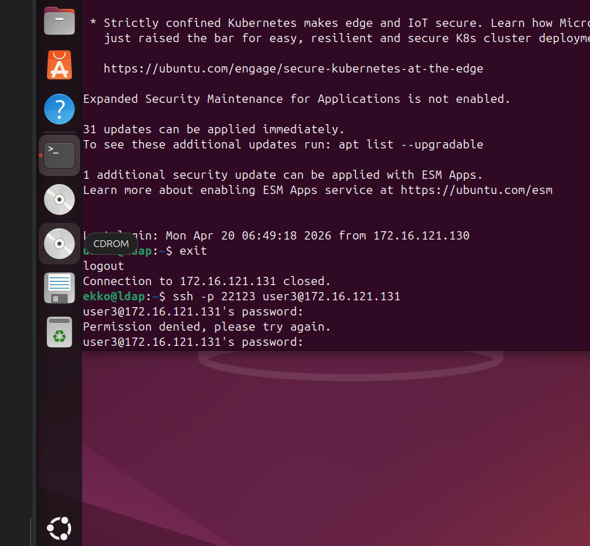
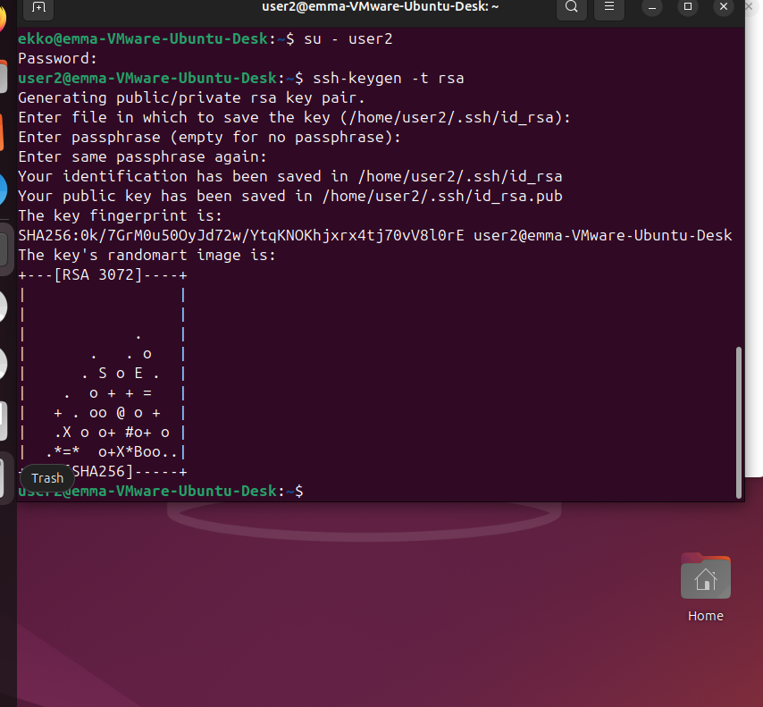
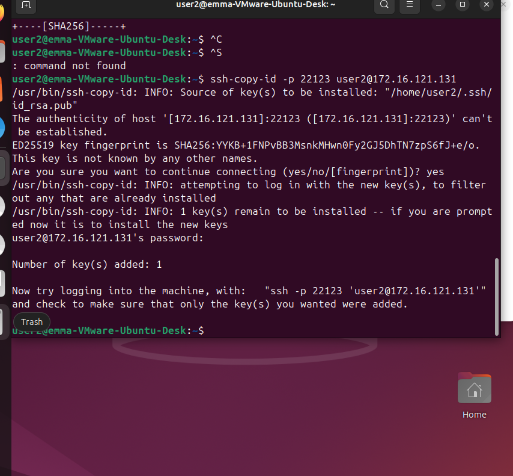
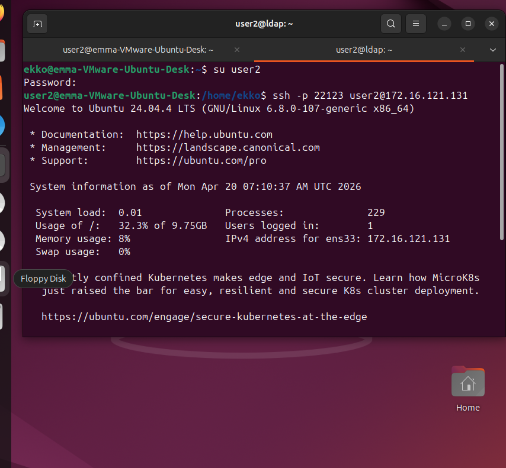
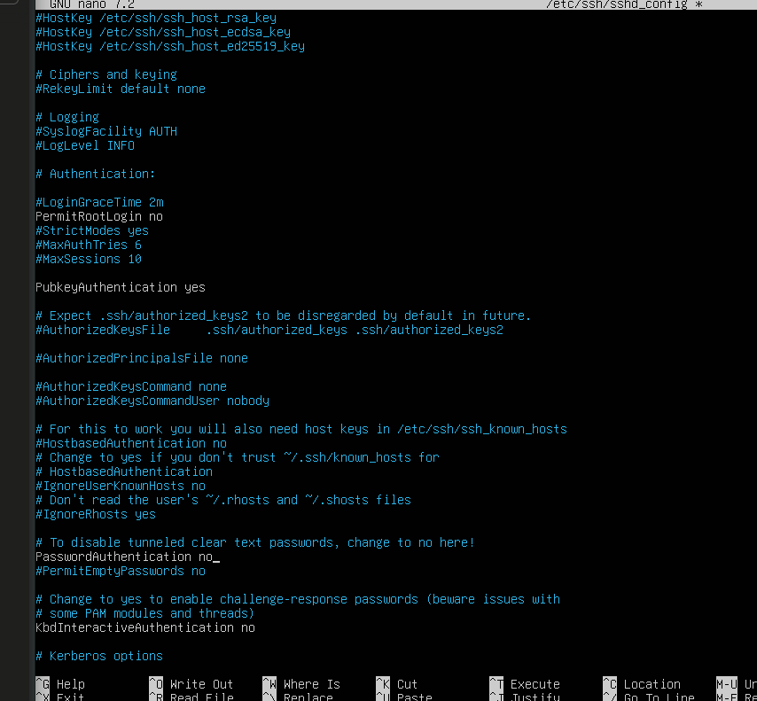
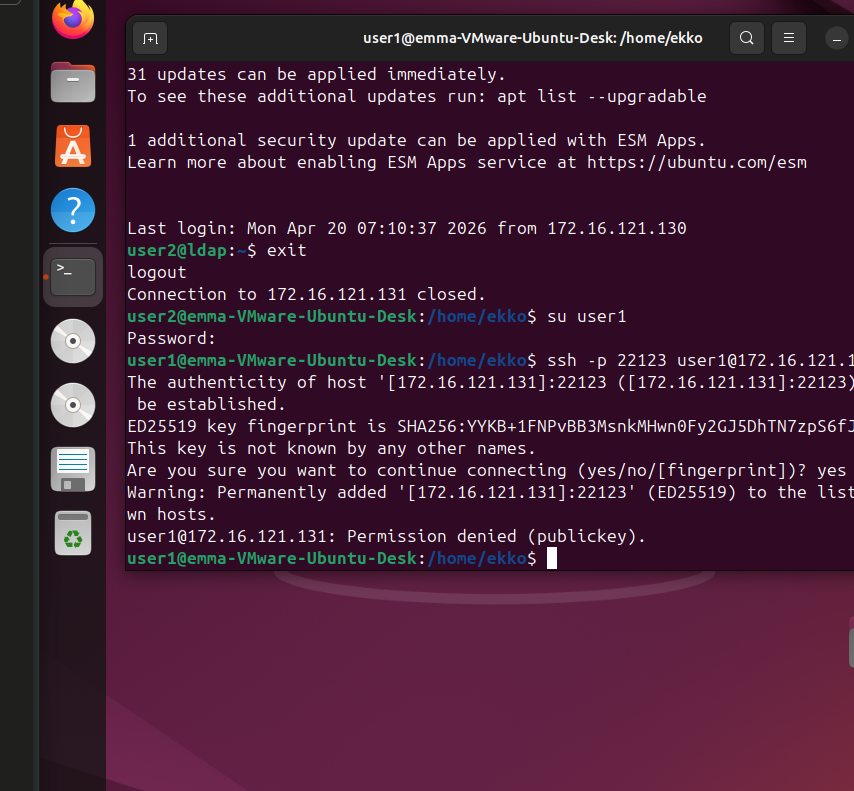

Remote Authentication & SSH
Remote Login Overview
Remote login is used when users need to authenticate to a central service over the network (mail server, HR system, CRM, billing, etc.)

SSH is used as a lab demo service (not representative of a typical business app)
Old protocols rlogin and rsh are unencrypted — remove them
Use OpenSSH instead

bashsudo apt-get install openssh-server
sudo service ssh start

Hardening SSH
Config file: /etc/ssh/sshd_config
Always back up first:
bashsudo cp /etc/ssh/sshd_config /etc/ssh/sshd_config.bak

1. Change default port
Port 22123

Avoids automatic detection by standard scans
nmap scans port 22 by default and won't find the service

2. Disable root login
PermitRootLogin no

Ubuntu default is prohibit-password (no root login with password)
Should be verified on every system — never assume

3. Restrict users / groups
AllowUsers user1 user13 user17
AllowGroups group1 admin

4. Restart after changes
bashsudo service ssh restart

SSH Hardening Summary
ProtectionHowNon-standard portPort 22123 in sshd_configDisable root loginPermitRootLogin noLeast privilegeAllowUsers / AllowGroupsEncrypted trafficSSH encrypts by defaultGeographic restrictionFirewall / fail2ban rulesTime-based restrictionPAM time moduleSession timeoutClientAliveInterval in sshd_config

Public/Private Key Authentication
Password = something you know → guessable, reusable, phishable
Private key = something you have → not guessable, 256-bit key space (~10⁷⁵ combinations)
Key generation (on client):
bashsu user1
ssh-keygen -t rsa        # keys saved to ~/.ssh/

~/.ssh/id_rsa → private key (never share)
~/.ssh/id_rsa.pub → public key (safe to share/copy)
Optional: add a passphrase to protect the private key file

Copy public key to server:
bash > ssh-copy-id 192.168.x.x

Adds public key to ~/.ssh/authorized_keys on the server

Disable password login (force key-only):
PasswordAuthentication no
in /etc/ssh/sshd_config

Why is the public key safe to copy/sniff?

The public key can only verify — it cannot be used to log in.
Only the private key proves identity. Asymmetric crypto: what one key encrypts, only the other can decrypt.

Key Auth + Passphrase = 2FA
FactorElementSomething you haveThe private key fileSomething you knowThe passphrase
→ Stronger than password alone, and qualifies as true 2FA

su and sudo after Remote Login

Remote root login disabled → attacker must compromise a normal user first
Even then, sudo only works for users in /etc/sudoers
To restrict su command itself:

Change file permissions / ACL on /bin/su

WHY better with passphrases than password?
A password can be guessed, brute-forced, phished or reused
A private key is 256-bit — ~10⁷⁵ possible combinations, practically impossible to brute force
To steal a key an attacker needs physical access to the client machine
Add a passphrase on top → now it's 2FA (something you have + something you know)